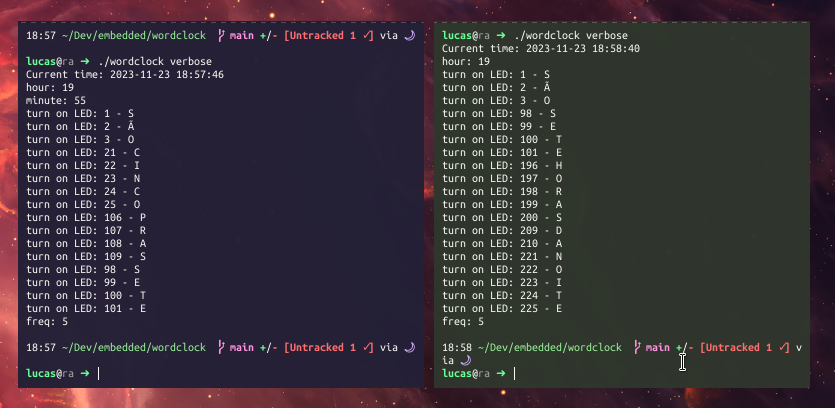

# Tempolavra

<!--  -->

This wordclock is a creative and unique way to display the time using words instead of numbers. This C++ project currently outputs a digital wordclock to the terminal. The end goal is to actually extend to the physical world, by building an actual Wordclock with wood, glass/acrylic front plate, and a matrix of individually addressable LEDs (under the frontplate), powered by an ESP32 microcontroller. (I'll update this repo with a picture once it's done!)

### Wordclock plate design:
```
S   Ã   O   É   O   J   G   T   U   R   W   Z   N   X   A
E   T   R   Ê   S   C   I   N   C   O   A   F   Y   B   P
U   M   A   Q   U   A   T   R   O   P   V   I   N   T   E
D   H   W   D   U   A   S   Q   O   I   T   O   L   V   I
O   N   Z   E   G   S   E   I   S   B   D   E   Z   A   Y
K   J   N   O   V   E   B   Q   U   I   N   Z   E   U   F
W   R   D   O   Z   E   F   S   E   T   E   B   E   H   T
P   R   A   S   M   E   I   O   V   D   I   A   D   A   E
V   I   N   T   E   M   E   I   A   Q   U   I   N   Z   E
N   O   I   T   E   T   R   I   N   T   A   E   F   Y   X
N   O   V   E   D   U   A   S   U   M   A   S   E   T   E
A   M   O   D   E   Z   S   E   I   S   H   O   I   T   O
Q   U   A   T   R   O   T   R   E   S   C   I   N   C   O
H   O   R   A   S   D   I   A   E   M   E   I   A   D   A
M   A   N   H   Ã   T   A   R   D   E   N   O   I   T   E
```

### Features
- Displays the current time using words, making it a stylish conversation piece.
- When ported to the microcontroller, there will be a companion app in order to set wifi configuration, since the onboard clock is very imprecise (will be wrong by a couple hours within a week).
- Since the letters in the matrix are fixed, I designed it to display the time in Portuguese only.
- More coming...

### Getting Started
License
This project is licensed under the GPLv3 - see the LICENSE file for details.

Acknowledgments
Inspired by creative wordclock designs around the world.
Enjoy telling time with words!
