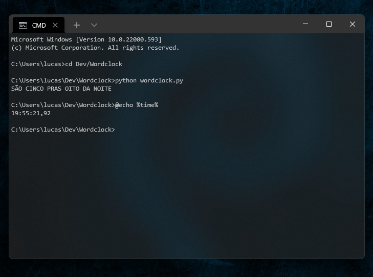

# Tempolavra

Tempolavra is a Python package that generates a wordclock in Portuguese. Basically, it displays the current time using words, arranged in a grid, which form the phrase for the current time, with 5 minute intervals.

The word clock currently runs on the terminal. However, I plan on making an ESP32 or ESP8266 and LED DIY project out of it in the future.

---

This is the wordclock plate design:

```
S   Ã   O   É   O   J   G   T   U   R   W   Z   N   X   A
E   T   R   Ê   S   C   I   N   C   O   A   F   Y   B   P
U   M   A   Q   U   A   T   R   O   P   V   I   N   T   E
D   H   W   D   U   A   S   Q   O   I   T   O   L   V   I
O   N   Z   E   G   S   E   I   S   B   D   E   Z   A   Y
K   J   N   O   V   E   B   Q   U   I   N   Z   E   U   F
W   R   D   O   Z   E   F   S   E   T   E   B   E   H   T
P   R   A   S   M   E   I   O   V   D   I   A   D   A   E
V   I   N   T   E   M   E   I   A   Q   U   I   N   Z   E
N   O   I   T   E   T   R   I   N   T   A   E   F   Y   X
N   O   V   E   D   U   A   S   U   M   A   S   E   T   E
A   M   O   D   E   Z   S   E   I   S   H   O   I   T   O
Q   U   A   T   R   O   T   R   E   S   C   I   N   C   O
H   O   R   A   S   D   I   A   E   M   E   I   A   D   A
M   A   N   H   Ã   T   A   R   D   E   N   O   I   T   E
```

and it makes up the following words, per row:

```
- sao é
- tres cinco
- uma quatro vinte
- duas oito
- onze seis dez
- nove quinze u
- doze sete e
- pras meio dia da e
- vinte meia quinze
- noite trinta e
- nove duas uma sete
- dez seis oito
- quatro tres cinco
- horas dia e meia da
- manhã tarde noite
```

---

The esp32 project was put on hold, as the memory available on that board is really low, so for this prototype I'll stick with python and a raspberry pi. Once I get an MVP of this product I might try a different programming language such as C++ or Rust to get the same result with a much lower memory footprint, also lowering the costs by using a board like the esp32.



---

TODO:
- think about the possibility of abastracting/separating word indexing and getting the time, to allow for different front plate design.
- cli flag to print letter coords (to simulate leds) instead of actual time.
- random functions, such as turn on all LEDs (for quality testing)
- 10% chance of getting "da /horas/manhã/noite" per hour (for the whole hour)
- if less than 4 words, append 'noite/manhã/tarde' (except: meio dia/noite)
- Small % to animate stuff randomly for 5 minutes, or until button pressed.
- If button pressed, animate for 30 minutes or until button pressed again.
- new years countdown ?
- throw docs assets (like a package logo) in docs/assets